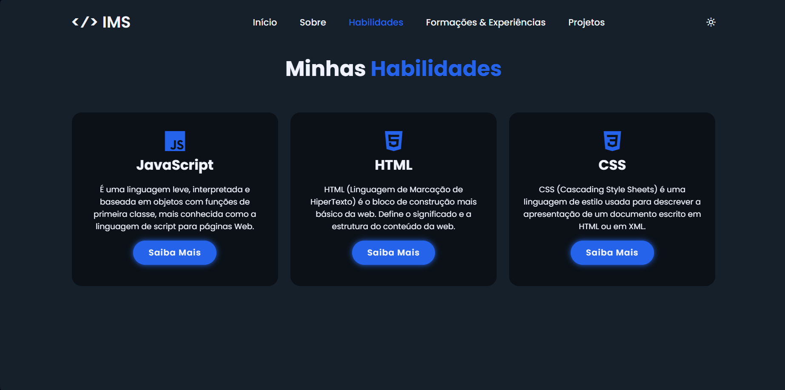

<h1 align="center" style="font-weight: bold;">Portifólio 💻</h1>

    <b>Meu primeiro portfólio</b> 

   Feito utilizando:  
    
    

     <a href="https://portfolio-cyan-ten-54.vercel.app">Visite este projeto</a>

## Imagens da página:

    
    
    
    

